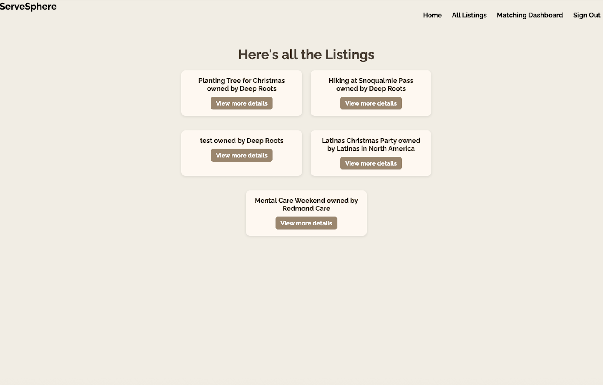
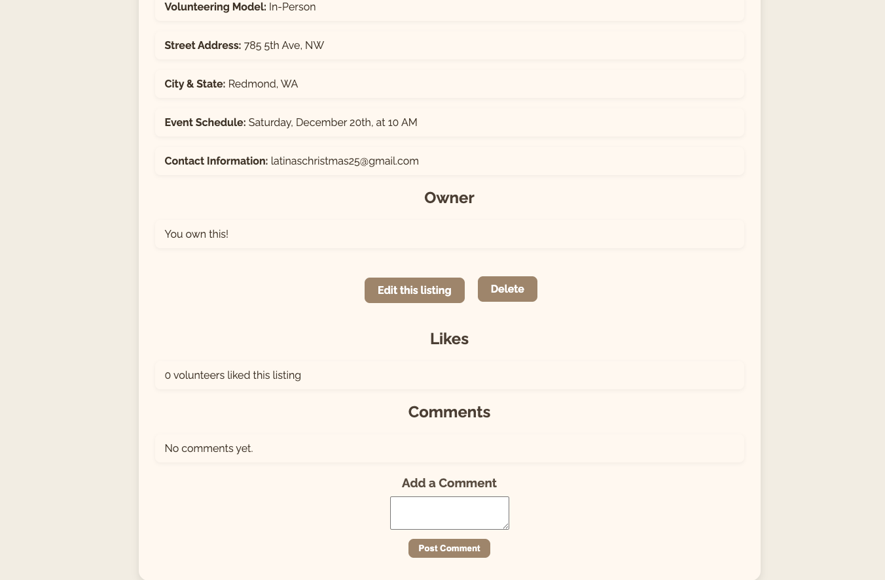

# ServeSphere 

## 1. Website Description & Functionalities

**ServeSphere** is a volunteer hub designed to connect volunteers with organizations that are creating opportunities for positive social impact. The user can participate as a volunteer, an organization, or both, once logs in.

Each user can create one volunteer profile, which represents their personal volunteering preferences. This profile can be edited at any time to reflect preference changes. In addition, a user may create multiple organization profiles, and organizations can create multiple listings, each representing a volunteering opportunity. This establishes the following relationship reflected in the project schemas using referencing:

* User <-> Volunteer: one-to-one
* User <-> Organization: one-to-many
* Organization <-> Listing: one-to-many

Users can browse all available listings through dedicated page **All Listings**, where opportunities from all organizations are displayed. To help users find relevant opportunities more easily, ServeSphere includes a **Matching Dashboard**.

The matching system works in both directions:

* If the user is a volunteer, the dashboard shows listings that match their profile.
* If the user is an organization, the dashboard displays volunteers who match the organization's listings.

A match occurs when three parameters align:

1. Volunteering Cause
2. Volunteering Model (Remote or In-Person)
3. State (location)

In addition to matching, volunteers can like and comment on listings they are interested in. Organizations can also comment on their own listings and are allowed to moderate comments by deleting volunteer comments on listings they own.

> **Why this platform?** I love volunteering, and I wanted to create a practical, real-world application that supports community engagement and social good by making it esier for volunteers and organizations to find meanignful matches.

## 2. Getting started

* Link to planning materials: [Trello](https://trello.com/b/UvrzWVbo/project2)
* Link to access the website: [Deployed Website](https://volunteer-hub-125fb4eb2754.herokuapp.com/)

> **Note:** The Trello link contains the MVP wireframes and ERD, as well as the user stories and stretch goals.

1. Log in or Sign up: Create an account and access ServeSphere as a volunteer, an organization, or both.

2. Create a volunteer profile and/or, if applicable, one or more organization profiles with volunteer opportunity listings.

3. Explore Opportunities: Browse all available listings and view personalized matches through the Matching Dashboard.

4. Engage: Like, comment on listings as a volunteer, and manage discussions on listings you own as an organization.

## 3. Technologies Used

* JavaScript
* HTML 
* CSS 
* EJS 
* Node.js 
* Express 
* MongoDB

## 4. External Resources

* [Mongoose Documentation](https://mongoosejs.com/docs/)
* [MDN Documentation](https://developer.mozilla.org/en-US/)
* [W3Schools](https://www.w3schools.com/)
* [Unsplash](https://unsplash.com/)

## 5. Next Steps

* Add additional pages, such as a Community Page, where users can interact with each other, and a dedicated page for sharing volunteering stories.
* Integrate an API to populate the city field in forms dynamically.
* Allow users to upload photos directly from their local devices.
* Enhance responsive design to better support different screen sizes and devices.